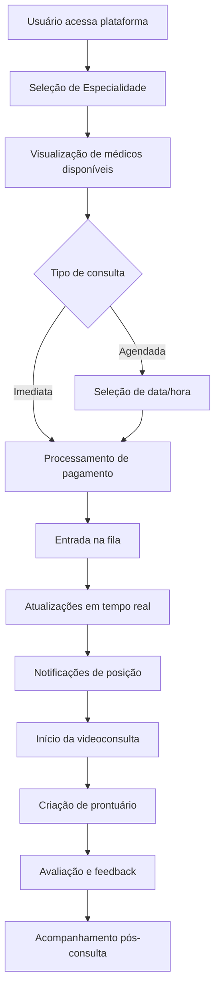

# Documento de Design - Sistema de Consultas de Telemedicina

## Visão Geral

O Sistema de Consultas de Telemedicina é uma plataforma web completa que integra seleção de especialidades, processamento de pagamentos, gerenciamento de fila em tempo real e videoconsultas. A arquitetura utiliza JavaScript vanilla no frontend com Supabase como backend, proporcionando uma experiência fluida e escalável para consultas médicas online 24/7.

## Arquitetura

### Componentes Principais

1. **Frontend (Client-side)**
   - Interface web responsiva em HTML/CSS/JavaScript
   - Sistema de navegação SPA (Single Page Application)
   - Gerenciamento de estado global via TeleMed object
   - Componentes modulares para cada funcionalidade

2. **Backend (Supabase)**
   - PostgreSQL para armazenamento de dados
   - Autenticação e autorização nativa
   - Real-time subscriptions para atualizações em tempo real
   - Edge Functions para lógica de negócio complexa

3. **Integrações Externas**
   - WebRTC para videochamadas (Jitsi Meet)
   - Gateway de pagamento para processamento seguro
   - WhatsApp API para notificações
   - Serviço de email para comunicações

### Fluxo de Dados Principal



## Componentes e Interfaces

### 1. Esquema do Banco de Dados

**Tabela: specialties**
```sql
CREATE TABLE specialties (
  id UUID DEFAULT gen_random_uuid() PRIMARY KEY,
  name VARCHAR(255) NOT NULL,
  description TEXT,
  icon VARCHAR(10),
  price DECIMAL(10,2) NOT NULL,
  duration INTEGER DEFAULT 30,
  is_active BOOLEAN DEFAULT true,
  created_at TIMESTAMP WITH TIME ZONE DEFAULT NOW()
);
```

**Tabela: doctors**
```sql
CREATE TABLE doctors (
  id UUID DEFAULT gen_random_uuid() PRIMARY KEY,
  user_id UUID REFERENCES auth.users(id),
  name VARCHAR(255) NOT NULL,
  crm VARCHAR(50) UNIQUE NOT NULL,
  specialty_id UUID REFERENCES specialties(id),
  experience_years INTEGER,
  rating DECIMAL(3,2) DEFAULT 0,
  total_consultations INTEGER DEFAULT 0,
  is_online BOOLEAN DEFAULT false,
  availability_status VARCHAR(20) DEFAULT 'offline',
  created_at TIMESTAMP WITH TIME ZONE DEFAULT NOW()
);
```

**Tabela: appointments**
```sql
CREATE TABLE appointments (
  id UUID DEFAULT gen_random_uuid() PRIMARY KEY,
  patient_id UUID REFERENCES auth.users(id),
  doctor_id UUID REFERENCES doctors(id),
  specialty_id UUID REFERENCES specialties(id),
  scheduled_date DATE,
  scheduled_time TIME,
  duration INTEGER DEFAULT 30,
  status VARCHAR(20) DEFAULT 'scheduled',
  type VARCHAR(20) DEFAULT 'video',
  price DECIMAL(10,2) NOT NULL,
  symptoms TEXT,
  notes TEXT,
  payment_id VARCHAR(255),
  queue_position INTEGER,
  created_at TIMESTAMP WITH TIME ZONE DEFAULT NOW(),
  updated_at TIMESTAMP WITH TIME ZONE DEFAULT NOW()
);
```

**Tabela: consultation_queue**
```sql
CREATE TABLE consultation_queue (
  id UUID DEFAULT gen_random_uuid() PRIMARY KEY,
  appointment_id UUID REFERENCES appointments(id),
  specialty_id UUID REFERENCES specialties(id),
  patient_id UUID REFERENCES auth.users(id),
  position INTEGER NOT NULL,
  estimated_wait_time INTEGER,
  status VARCHAR(20) DEFAULT 'waiting',
  joined_at TIMESTAMP WITH TIME ZONE DEFAULT NOW(),
  notified_at TIMESTAMP WITH TIME ZONE
);
```

**Tabela: medical_records**
```sql
CREATE TABLE medical_records (
  id UUID DEFAULT gen_random_uuid() PRIMARY KEY,
  appointment_id UUID REFERENCES appointments(id),
  patient_id UUID REFERENCES auth.users(id),
  doctor_id UUID REFERENCES doctors(id),
  diagnosis TEXT,
  prescription TEXT,
  recommendations TEXT,
  digital_signature TEXT,
  pdf_url TEXT,
  created_at TIMESTAMP WITH TIME ZONE DEFAULT NOW()
);
```

**Tabela: notifications**
```sql
CREATE TABLE notifications (
  id UUID DEFAULT gen_random_uuid() PRIMARY KEY,
  user_id UUID REFERENCES auth.users(id),
  type VARCHAR(50) NOT NULL,
  title VARCHAR(255) NOT NULL,
  message TEXT NOT NULL,
  channels JSONB DEFAULT '[]',
  is_read BOOLEAN DEFAULT false,
  sent_at TIMESTAMP WITH TIME ZONE DEFAULT NOW()
);
```

### 2. Componentes Frontend

**Gerenciador de Especialidades (specialties.js)**
- Renderização de cards de especialidades
- Sistema de busca e filtros
- Modal de detalhes com informações completas
- Integração com sistema de agendamento

**Gerenciador de Consultas (appointments.js)**
- Interface de agendamento com calendário
- Visualização de consultas (próximas/anteriores)
- Sistema de reagendamento e cancelamento
- Controles de entrada em consulta

**Sistema de Fila (queue.js)**
- Atualizações em tempo real da posição
- Estimativas de tempo de espera
- Notificações visuais e sonoras
- Controle de timeout e reposicionamento

**Interface de Videochamada (videocall.js)**
- Integração com WebRTC/Jitsi
- Controles de áudio/vídeo
- Chat durante consulta
- Gravação de sessão (opcional)

**Sistema de Pagamentos (payments.js)**
- Integração com gateway de pagamento
- Validação de cartão de crédito
- Processamento de reembolsos
- Histórico de transações

**Assistente de IA (chat.js)**
- Interface de chat inteligente
- Sugestões de especialidades baseadas em sintomas
- Escalação para suporte humano
- Histórico de conversas

### 3. Modelos de Dados

**Modelo de Especialidade**
```javascript
interface Specialty {
  id: string;
  name: string;
  description: string;
  icon: string;
  price: number;
  duration: number;
  waitTime: string;
  doctorsOnline: number;
  rating: number;
  reviews: number;
  features: string[];
  doctors: Doctor[];
}
```

**Modelo de Consulta**
```javascript
interface Appointment {
  id: string;
  patientId: string;
  doctorId: string;
  specialtyId: string;
  scheduledDate: string;
  scheduledTime: string;
  duration: number;
  status: AppointmentStatus;
  type: AppointmentType;
  price: number;
  symptoms: string;
  notes: string;
  queuePosition?: number;
  estimatedWaitTime?: number;
}
```

**Modelo de Fila**
```javascript
interface QueueEntry {
  id: string;
  appointmentId: string;
  specialtyId: string;
  patientId: string;
  position: number;
  estimatedWaitTime: number;
  status: QueueStatus;
  joinedAt: Date;
  notifiedAt?: Date;
}
```

## Tratamento de Erros

### 1. Erros de Frontend
- **Conectividade**: Detecção de perda de conexão com retry automático
- **Validação**: Validação de formulários em tempo real
- **Estado**: Recuperação de estado após erros de navegação
- **Timeout**: Tratamento de timeouts em operações críticas

### 2. Erros de Backend
- **Database**: Tratamento de constraints e deadlocks
- **Autenticação**: Renovação automática de tokens
- **Rate Limiting**: Controle de frequência de requisições
- **Transações**: Rollback automático em falhas

### 3. Erros de Integração
- **Pagamento**: Retry automático e notificação de falhas
- **Videochamada**: Fallback para áudio em caso de problemas
- **Notificações**: Múltiplos canais com fallback
- **IA**: Escalação para suporte humano em falhas

## Estratégia de Testes

### 1. Testes Unitários
- Funções utilitárias (formatação, validação)
- Componentes isolados
- Lógica de negócio
- Integração com APIs

### 2. Testes de Integração
- Fluxo completo de agendamento
- Sistema de pagamentos
- Notificações em tempo real
- Sincronização de dados

### 3. Testes End-to-End
- Jornada completa do paciente
- Cenários de erro e recuperação
- Performance sob carga
- Compatibilidade entre navegadores

### 4. Testes de Usabilidade
- Interface responsiva
- Acessibilidade (WCAG 2.1)
- Experiência em dispositivos móveis
- Tempo de resposta percebido

## Considerações de Segurança

### 1. Autenticação e Autorização
- JWT tokens com expiração configurável
- Row Level Security (RLS) no Supabase
- Validação de permissões em todas as operações
- Logout automático por inatividade

### 2. Proteção de Dados
- Criptografia de dados sensíveis
- Sanitização de inputs
- Validação server-side
- Auditoria de acessos

### 3. Comunicação Segura
- HTTPS obrigatório
- WebRTC com criptografia end-to-end
- Validação de certificados
- Proteção contra CSRF

### 4. Conformidade Médica
- Conformidade com LGPD
- Assinatura digital de prontuários
- Rastreabilidade de alterações
- Backup seguro de dados médicos

## Implementação em Tempo Real

### 1. Sistema de Fila
```javascript
// Subscription para atualizações de fila
const queueSubscription = supabase
  .channel('queue-updates')
  .on('postgres_changes', {
    event: '*',
    schema: 'public',
    table: 'consultation_queue'
  }, (payload) => {
    updateQueuePosition(payload);
  })
  .subscribe();
```

### 2. Notificações Push
```javascript
// Sistema de notificações em tempo real
const notificationSubscription = supabase
  .channel('user-notifications')
  .on('postgres_changes', {
    event: 'INSERT',
    schema: 'public',
    table: 'notifications',
    filter: `user_id=eq.${userId}`
  }, (payload) => {
    showNotification(payload.new);
  })
  .subscribe();
```

### 3. Status de Médicos
```javascript
// Atualizações de disponibilidade médica
const doctorStatusSubscription = supabase
  .channel('doctor-status')
  .on('postgres_changes', {
    event: 'UPDATE',
    schema: 'public',
    table: 'doctors'
  }, (payload) => {
    updateDoctorAvailability(payload);
  })
  .subscribe();
```

## Otimização de Performance

### 1. Frontend
- Lazy loading de componentes
- Debounce em buscas
- Cache de dados estáticos
- Compressão de imagens

### 2. Backend
- Índices otimizados no banco
- Connection pooling
- Cache de consultas frequentes
- CDN para assets estáticos

### 3. Rede
- Compressão gzip
- HTTP/2 push
- Preload de recursos críticos
- Service workers para cache

## Monitoramento e Analytics

### 1. Métricas de Negócio
- Taxa de conversão de agendamentos
- Tempo médio de espera
- Satisfação do paciente
- Taxa de cancelamento

### 2. Métricas Técnicas
- Tempo de resposta das APIs
- Taxa de erro por endpoint
- Uso de recursos do servidor
- Performance do frontend

### 3. Alertas
- Falhas de pagamento
- Indisponibilidade de médicos
- Erros críticos do sistema
- Picos de tráfego

## Escalabilidade

### 1. Horizontal
- Load balancing de requisições
- Sharding de banco de dados
- CDN global
- Auto-scaling de recursos

### 2. Vertical
- Otimização de queries
- Cache em múltiplas camadas
- Compressão de dados
- Pooling de conexões

### 3. Arquitetural
- Microserviços para funcionalidades específicas
- Event-driven architecture
- CQRS para operações complexas
- API Gateway para roteamento

Este design fornece uma base sólida para implementar o sistema completo de telemedicina, garantindo escalabilidade, segurança e uma excelente experiência do usuário.