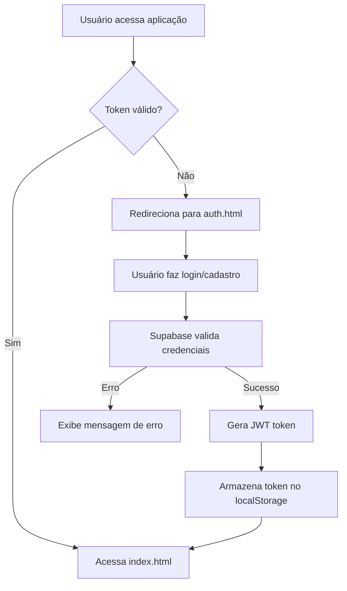

# Design Document - Sistema de Autenticação de Usuários

## Overview

O sistema de autenticação será implementado como uma aplicação web client-side que se comunica com o Supabase para gerenciamento de usuários e autenticação. A arquitetura utilizará HTML/CSS/JavaScript vanilla no frontend e aproveitará as funcionalidades nativas de autenticação do Supabase, incluindo JWT tokens e hash de senhas.

## Architecture

### Componentes Principais

1. **Frontend (Client-side)**
   - Tela de Login/Cadastro (auth.html)
   - Tela Principal Protegida (index.html)
   - JavaScript para gerenciamento de autenticação
   - CSS para estilização das telas

2. **Backend (Supabase)**
   - Tabela de usuários no PostgreSQL
   - Sistema de autenticação nativo do Supabase
   - Geração e validação de JWT tokens
   - Hash automático de senhas

3. **Fluxo de Dados**


## Components and Interfaces

### 1. Database Schema (Supabase)

**Tabela: users**
```sql
CREATE TABLE users (
  id UUID DEFAULT gen_random_uuid() PRIMARY KEY,
  email VARCHAR(255) UNIQUE NOT NULL,
  name VARCHAR(255) NOT NULL,
  created_at TIMESTAMP WITH TIME ZONE DEFAULT NOW(),
  updated_at TIMESTAMP WITH TIME ZONE DEFAULT NOW()
);
```

**Nota:** O Supabase gerencia automaticamente a tabela `auth.users` para autenticação, mas criaremos uma tabela `public.users` para dados adicionais como nome.

### 2. Frontend Components

**auth.html - Tela de Login/Cadastro**
- Formulário de login (email, senha)
- Formulário de cadastro (nome, email, senha)
- Toggle entre login e cadastro
- Validação de campos
- Exibição de mensagens de erro/sucesso

**index.html - Tela Principal**
- Verificação de autenticação na inicialização
- Botão de logout
- Conteúdo protegido da aplicação

**auth.js - Gerenciamento de Autenticação**
- Funções de login e cadastro
- Validação de token JWT
- Gerenciamento do localStorage
- Redirecionamentos automáticos

### 3. Supabase Client Integration

**Configuração do Cliente**
```javascript
const supabaseUrl = 'https://xfgpoixiqppajhgkcwse.supabase.co'
const supabaseKey = 'ANON_KEY' // Chave pública
const supabase = createClient(supabaseUrl, supabaseKey)
```

## Data Models

### User Model (Frontend)
```javascript
interface User {
  id: string;
  email: string;
  name: string;
  created_at: string;
  updated_at: string;
}
```

### Authentication Response
```javascript
interface AuthResponse {
  user: User | null;
  session: Session | null;
  error: Error | null;
}
```

### Session Model
```javascript
interface Session {
  access_token: string;
  refresh_token: string;
  expires_at: number;
  user: User;
}
```

## Error Handling

### Frontend Error Handling
1. **Validação de Formulário**
   - Campos obrigatórios
   - Formato de email válido
   - Senha com mínimo de caracteres

2. **Erros de Autenticação**
   - Credenciais inválidas
   - Email já cadastrado
   - Problemas de conexão

3. **Erros de Token**
   - Token expirado
   - Token inválido
   - Token não encontrado

### Backend Error Handling (Supabase)
1. **Constraints de Banco**
   - Email único
   - Campos obrigatórios

2. **Autenticação**
   - Rate limiting automático
   - Validação de senha
   - Verificação de email

## Testing Strategy

### 1. Testes Manuais
- Fluxo completo de cadastro
- Fluxo completo de login
- Verificação de persistência de sessão
- Teste de logout
- Validação de campos obrigatórios
- Teste de email duplicado

### 2. Testes de Segurança
- Verificação de hash de senhas
- Validação de tokens JWT
- Teste de acesso não autorizado
- Verificação de expiração de token

### 3. Testes de Integração
- Comunicação com Supabase
- Armazenamento no localStorage
- Redirecionamentos automáticos

## Security Considerations

### 1. Autenticação
- Uso do sistema nativo do Supabase para hash de senhas
- JWT tokens com expiração configurável
- Validação server-side de todos os tokens

### 2. Frontend Security
- Sanitização de inputs
- Validação de dados antes do envio
- Armazenamento seguro de tokens

### 3. Database Security
- Row Level Security (RLS) habilitado
- Políticas de acesso baseadas em usuário autenticado
- Constraints de integridade de dados

## Implementation Notes

### 1. Supabase Configuration
- Habilitar autenticação por email/senha
- Configurar políticas RLS na tabela users
- Definir tempo de expiração dos tokens

### 2. Frontend Structure
```
/
├── auth.html          # Tela de login/cadastro
├── index.html         # Tela principal protegida
├── css/
│   ├── auth.css       # Estilos da tela de autenticação
│   └── main.css       # Estilos gerais
└── js/
    ├── auth.js        # Lógica de autenticação
    ├── main.js        # Lógica da aplicação principal
    └── supabase.js    # Configuração do Supabase
```

### 3. Environment Variables
- Chave pública do Supabase (pode ser exposta no frontend)
- URL do projeto Supabase
- Configurações de JWT (gerenciadas pelo Supabase)

Este design aproveita as funcionalidades nativas do Supabase para simplificar a implementação enquanto mantém alta segurança e escalabilidade.