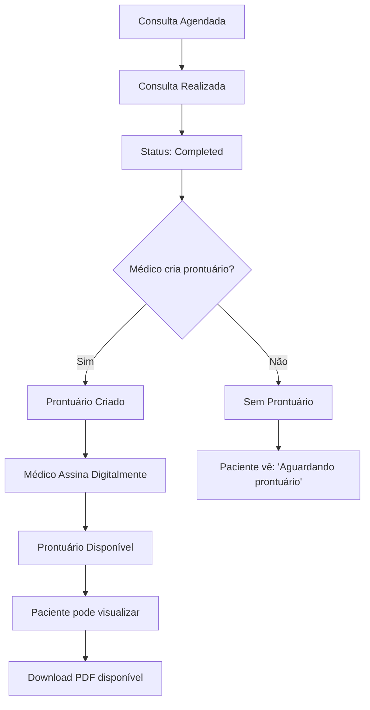

# 🏥 Integração: Sistema de Gerenciamento de Consultas + Prontuários Médicos

## Visão Geral

Este documento descreve a integração completa entre o **Sistema de Gerenciamento de Consultas** (Tarefa 14) e o **Sistema de Prontuários Médicos** já existente no TeleMed. A integração permite que os pacientes visualizem suas consultas junto com os prontuários médicos associados, criando um histórico médico completo e integrado.

## 🎯 Funcionalidades Integradas

### 1. **Visualização Unificada de Consultas e Prontuários**
- Grid de consultas mostra status do prontuário para cada consulta concluída
- Botão "📄 Prontuário" disponível apenas para consultas finalizadas
- Indicação visual se o prontuário foi criado e assinado pelo médico

### 2. **Histórico Médico Completo**
- Interface unificada que combina consultas e prontuários
- Filtros avançados por especialidade, médico, período
- Busca textual em diagnósticos, prescrições e observações
- Estatísticas do histórico médico do paciente

### 3. **Download e Exportação**
- Download individual de prontuários em PDF
- Download de prescrições médicas separadamente
- Exportação completa do histórico médico
- Relatórios estatísticos personalizados

### 4. **Consultas de Retorno Integradas**
- Agendamento de retorno baseado em consultas anteriores
- Manutenção do histórico médico na nova consulta
- Referência ao prontuário da consulta original

## 🔧 Arquitetura da Integração

### Estrutura de Dados Integrada

```javascript
// Consulta com referência ao prontuário
const appointment = {
    id: 'apt-123',
    patient: 'João Silva',
    doctor: 'Dr. Roberto Santos',
    specialty: 'Cardiologia',
    date: '2024-01-15',
    time: '14:00',
    status: 'completed',
    price: 89.90,
    symptoms: 'Dor no peito',
    notes: 'Consulta de rotina',
    
    // Referência ao prontuário (se existir)
    medical_record_id: 'rec-456'
};

// Prontuário médico associado
const medicalRecord = {
    id: 'rec-456',
    appointment_id: 'apt-123',
    patient_id: 'patient-789',
    doctor_id: 'doctor-101',
    diagnosis: 'Hipertensão arterial leve',
    prescription: 'Losartana 50mg - 1x ao dia',
    recommendations: 'Dieta com baixo teor de sódio',
    additional_notes: 'Paciente colaborativo',
    is_signed: true,
    digital_signature: '{"doctor":"Dr. Roberto Santos",...}',
    created_at: '2024-01-15T14:30:00Z',
    updated_at: '2024-01-15T15:00:00Z'
};
```

### Fluxo de Integração



## 📋 Funcionalidades Implementadas

### 1. **Visualização de Consultas com Prontuários**

```javascript
// Renderização de consulta com status do prontuário
function renderAppointmentCard(appointment, tabType) {
    const medicalRecord = findMedicalRecordByAppointment(appointment.id);
    const hasMedicalRecord = medicalRecord !== null;
    const isRecordSigned = medicalRecord?.is_signed || false;
    
    // Botão do prontuário só aparece se consulta foi concluída
    const medicalRecordButton = appointment.status === 'completed' ? `
        <button onclick="viewMedicalRecord('${appointment.id}')" 
                class="bg-purple-600 text-white px-4 py-2 rounded-lg hover:bg-purple-700 transition">
            📄 ${hasMedicalRecord ? 'Ver Prontuário' : 'Aguardando Prontuário'}
        </button>
    ` : '';
    
    return `
        <div class="appointment-card">
            <!-- Informações da consulta -->
            <div class="appointment-info">...</div>
            
            <!-- Status do prontuário -->
            ${hasMedicalRecord ? `
                <div class="medical-record-status">
                    <span class="status-indicator ${isRecordSigned ? 'signed' : 'unsigned'}">
                        ${isRecordSigned ? '✅ Prontuário Assinado' : '⏳ Aguardando Assinatura'}
                    </span>
                </div>
            ` : ''}
            
            <!-- Ações -->
            <div class="appointment-actions">
                ${medicalRecordButton}
                <!-- Outros botões... -->
            </div>
        </div>
    `;
}
```

### 2. **Interface de Histórico Médico Completo**

```javascript
// Função principal para mostrar histórico médico integrado
function viewPatientMedicalHistory() {
    // Verificar se sistema completo está disponível
    if (typeof showMedicalHistoryInterface === 'function') {
        showMedicalHistoryInterface();
    } else {
        // Fallback: interface básica integrada
        showBasicMedicalHistory();
    }
}

// Interface básica com integração consultas + prontuários
function showBasicMedicalHistory() {
    const completedAppointments = TeleMed.userAppointments.filter(apt => 
        apt.status === 'completed'
    );
    
    const medicalRecords = [];
    completedAppointments.forEach(appointment => {
        const record = findMedicalRecordByAppointment(appointment.id);
        if (record) {
            medicalRecords.push({
                ...record,
                appointment: appointment
            });
        }
    });
    
    // Renderizar interface completa...
}
```

### 3. **Sistema de Filtros e Busca Integrado**

```javascript
// Filtros avançados para histórico médico
function filterMedicalHistoryRecords(searchTerm = '') {
    const searchInput = document.getElementById('historySearch');
    const specialtyFilter = document.getElementById('historySpecialtyFilter');
    const periodFilter = document.getElementById('historyPeriodFilter');
    
    const search = searchTerm || searchInput.value.toLowerCase();
    const specialty = specialtyFilter.value;
    const period = periodFilter.value;
    
    const cards = document.querySelectorAll('.medical-history-card');
    let visibleCount = 0;
    
    cards.forEach(card => {
        let show = true;
        
        // Filtro de busca (diagnóstico, médico, especialidade)
        if (search && !card.dataset.search.toLowerCase().includes(search)) {
            show = false;
        }
        
        // Filtro de especialidade
        if (specialty && card.dataset.specialty !== specialty) {
            show = false;
        }
        
        // Filtro de período
        if (period) {
            const cardDate = new Date(card.dataset.date);
            const now = new Date();
            const daysAgo = parseInt(period);
            const cutoffDate = new Date(now.getTime() - daysAgo * 24 * 60 * 60 * 1000);
            
            if (cardDate < cutoffDate) {
                show = false;
            }
        }
        
        card.style.display = show ? 'block' : 'none';
        if (show) visibleCount++;
    });
    
    // Mostrar mensagem se nenhum resultado
    updateNoResultsMessage(visibleCount);
}
```

### 4. **Download e Exportação Integrados**

```javascript
// Download completo do histórico médico
function downloadCompleteHistory() {
    const completedAppointments = TeleMed.userAppointments.filter(apt => 
        apt.status === 'completed'
    );
    
    const medicalRecords = [];
    completedAppointments.forEach(appointment => {
        const record = findMedicalRecordByAppointment(appointment.id);
        if (record) {
            medicalRecords.push({ ...record, appointment });
        }
    });
    
    if (medicalRecords.length === 0) {
        showNotification('Aviso', 'Nenhum prontuário encontrado para download', 'warning');
        return;
    }
    
    // Usar sistema existente de download de PDFs
    if (typeof downloadMedicalRecordPDF === 'function') {
        medicalRecords.forEach((record, index) => {
            setTimeout(() => {
                downloadMedicalRecordPDF(record.id);
            }, index * 1000); // Delay entre downloads
        });
        
        showNotification('Sucesso', `Iniciando download de ${medicalRecords.length} prontuários`, 'success');
    } else {
        // Fallback: relatório simples
        generateSimpleHistoryReport(medicalRecords);
    }
}

// Exportação em CSV
function exportHistoryData() {
    const medicalRecords = getMedicalRecordsWithAppointments();
    
    if (medicalRecords.length === 0) {
        showNotification('Aviso', 'Nenhum dado para exportar', 'warning');
        return;
    }
    
    // Criar CSV
    const headers = ['Data', 'Hora', 'Médico', 'Especialidade', 'Diagnóstico', 'Prescrição', 'Assinado'];
    const csvContent = [
        headers.join(','),
        ...medicalRecords.map(record => [
            record.appointment.date,
            record.appointment.time,
            `"${record.appointment.doctor}"`,
            `"${record.appointment.specialty}"`,
            `"${record.diagnosis || ''}"`,
            record.prescription ? 'Sim' : 'Não',
            record.is_signed ? 'Sim' : 'Não'
        ].join(','))
    ].join('\n');
    
    // Download CSV
    const blob = new Blob([csvContent], { type: 'text/csv;charset=utf-8;' });
    const url = URL.createObjectURL(blob);
    const a = document.createElement('a');
    a.href = url;
    a.download = `historico_medico_${TeleMed.currentUser.name}_${new Date().toISOString().split('T')[0]}.csv`;
    a.click();
    URL.revokeObjectURL(url);
    
    showNotification('Sucesso', 'Dados do histórico exportados em CSV', 'success');
}
```

## 🎨 Interface do Usuário

### 1. **Cards de Consulta Integrados**

```html
<!-- Card de consulta com status do prontuário -->
<div class="appointment-card bg-white rounded-xl shadow-lg p-6">
    <!-- Cabeçalho da consulta -->
    <div class="appointment-header">
        <h3 class="doctor-name">Dr. Roberto Santos</h3>
        <span class="specialty">Cardiologia</span>
        <span class="date">15/01/2024 14:00</span>
    </div>
    
    <!-- Status do prontuário -->
    <div class="medical-record-status">
        <div class="status-indicator signed">
            ✅ Prontuário Assinado
        </div>
        <div class="record-info">
            <small>Criado em: 15/01/2024 15:00</small>
        </div>
    </div>
    
    <!-- Ações disponíveis -->
    <div class="appointment-actions">
        <button class="btn-view-details">📋 Detalhes</button>
        <button class="btn-view-record">📄 Ver Prontuário</button>
        <button class="btn-download-pdf">📥 Download PDF</button>
        <button class="btn-schedule-followup">🔄 Agendar Retorno</button>
    </div>
</div>
```

### 2. **Interface de Histórico Médico**

```html
<!-- Modal de histórico médico completo -->
<div id="medicalHistoryModal" class="modal-overlay">
    <div class="modal-content max-w-6xl">
        <!-- Cabeçalho -->
        <div class="modal-header">
            <h3>📚 Histórico Médico Completo</h3>
        </div>
        
        <!-- Resumo do paciente -->
        <div class="patient-summary bg-blue-50 p-6 rounded-lg">
            <h4>Informações do Paciente</h4>
            <div class="stats-grid">
                <div>Total de Consultas: 12</div>
                <div>Prontuários: 8</div>
                <div>Prescrições: 6</div>
                <div>Especialidades: 4</div>
            </div>
        </div>
        
        <!-- Filtros e busca -->
        <div class="filters-section">
            <input type="text" placeholder="Buscar por diagnóstico, médico...">
            <select>Filtrar por especialidade</select>
            <select>Filtrar por período</select>
        </div>
        
        <!-- Lista de prontuários -->
        <div class="medical-records-list">
            <!-- Cards de prontuários renderizados dinamicamente -->
        </div>
        
        <!-- Estatísticas -->
        <div class="history-statistics">
            <div class="stat-card">
                <div class="number">8</div>
                <div class="label">Prontuários</div>
            </div>
            <div class="stat-card">
                <div class="number">6</div>
                <div class="label">Assinados</div>
            </div>
            <!-- Mais estatísticas... -->
        </div>
        
        <!-- Ações -->
        <div class="history-actions">
            <button onclick="downloadCompleteHistory()">📄 Download Completo</button>
            <button onclick="generateHistoryReport()">📊 Gerar Relatório</button>
            <button onclick="exportHistoryData()">💾 Exportar CSV</button>
        </div>
    </div>
</div>
```

## 📊 Banco de Dados

### Estrutura das Tabelas Integradas

```sql
-- Tabela de consultas (appointments)
CREATE TABLE appointments (
    id UUID PRIMARY KEY DEFAULT gen_random_uuid(),
    patient_id UUID REFERENCES auth.users(id),
    doctor_id UUID REFERENCES doctors(id),
    specialty_id UUID REFERENCES specialties(id),
    date DATE NOT NULL,
    time TIME NOT NULL,
    duration INTEGER DEFAULT 30,
    status VARCHAR(20) DEFAULT 'scheduled',
    type VARCHAR(10) DEFAULT 'video',
    price DECIMAL(10,2) NOT NULL,
    symptoms TEXT,
    notes TEXT,
    created_at TIMESTAMP DEFAULT NOW(),
    updated_at TIMESTAMP DEFAULT NOW()
);

-- Tabela de prontuários médicos (medical_records)
CREATE TABLE medical_records (
    id UUID PRIMARY KEY DEFAULT gen_random_uuid(),
    appointment_id UUID REFERENCES appointments(id) UNIQUE,
    patient_id UUID REFERENCES auth.users(id),
    doctor_id UUID REFERENCES doctors(id),
    diagnosis TEXT NOT NULL,
    prescription TEXT,
    recommendations TEXT,
    additional_notes TEXT,
    is_signed BOOLEAN DEFAULT FALSE,
    digital_signature JSONB,
    pdf_url TEXT,
    created_at TIMESTAMP DEFAULT NOW(),
    updated_at TIMESTAMP DEFAULT NOW()
);

-- Índices para performance
CREATE INDEX idx_appointments_patient_status ON appointments(patient_id, status);
CREATE INDEX idx_medical_records_appointment ON medical_records(appointment_id);
CREATE INDEX idx_medical_records_patient ON medical_records(patient_id);
```

### Consultas SQL Integradas

```sql
-- Buscar consultas com prontuários do paciente
SELECT 
    a.id as appointment_id,
    a.date,
    a.time,
    a.status,
    a.symptoms,
    d.name as doctor_name,
    s.name as specialty_name,
    mr.id as medical_record_id,
    mr.diagnosis,
    mr.prescription,
    mr.is_signed,
    mr.created_at as record_created_at
FROM appointments a
LEFT JOIN medical_records mr ON a.id = mr.appointment_id
JOIN doctors d ON a.doctor_id = d.id
JOIN specialties s ON a.specialty_id = s.id
WHERE a.patient_id = $1
ORDER BY a.date DESC, a.time DESC;

-- Estatísticas do histórico médico
SELECT 
    COUNT(a.id) as total_appointments,
    COUNT(mr.id) as total_records,
    COUNT(CASE WHEN mr.is_signed THEN 1 END) as signed_records,
    COUNT(CASE WHEN mr.prescription IS NOT NULL THEN 1 END) as prescription_records,
    COUNT(DISTINCT a.specialty_id) as specialties_count
FROM appointments a
LEFT JOIN medical_records mr ON a.id = mr.appointment_id
WHERE a.patient_id = $1 AND a.status = 'completed';
```

## 🔒 Segurança e Privacidade

### 1. **Controle de Acesso**
- Pacientes só podem ver seus próprios prontuários
- Médicos só podem criar/editar prontuários de suas consultas
- Verificação de autenticação em todas as operações

### 2. **Auditoria**
- Log de todos os acessos aos prontuários
- Registro de downloads de PDFs
- Rastreamento de alterações nos prontuários

### 3. **Assinatura Digital**
- Prontuários devem ser assinados digitalmente pelo médico
- Hash de integridade para verificar alterações
- Timestamp de assinatura para validade legal

## 🧪 Testes da Integração

### Testes Automatizados

```javascript
// Teste de integração consulta + prontuário
describe('Integração Consultas e Prontuários', () => {
    test('deve mostrar botão de prontuário apenas para consultas concluídas', () => {
        const completedAppointment = { id: '1', status: 'completed' };
        const scheduledAppointment = { id: '2', status: 'scheduled' };
        
        const completedCard = renderAppointmentCard(completedAppointment, 'past');
        const scheduledCard = renderAppointmentCard(scheduledAppointment, 'upcoming');
        
        expect(completedCard).toContain('Ver Prontuário');
        expect(scheduledCard).not.toContain('Ver Prontuário');
    });
    
    test('deve filtrar histórico médico corretamente', () => {
        const records = [
            { appointment: { specialty: 'Cardiologia' }, diagnosis: 'Hipertensão' },
            { appointment: { specialty: 'Dermatologia' }, diagnosis: 'Acne' }
        ];
        
        const filtered = filterMedicalRecords(records, { specialty: 'Cardiologia' });
        expect(filtered).toHaveLength(1);
        expect(filtered[0].appointment.specialty).toBe('Cardiologia');
    });
    
    test('deve gerar relatório de histórico médico', () => {
        const report = generateHistoryReport();
        
        expect(report).toHaveProperty('patient');
        expect(report).toHaveProperty('summary');
        expect(report).toHaveProperty('consultationsByMonth');
        expect(report.summary).toHaveProperty('totalConsultations');
        expect(report.summary).toHaveProperty('totalRecords');
    });
});
```

### Testes Manuais

1. **Fluxo Completo de Consulta + Prontuário**
   - Agendar consulta
   - Realizar consulta (mudar status para 'completed')
   - Médico criar prontuário
   - Médico assinar prontuário
   - Paciente visualizar prontuário
   - Paciente baixar PDF

2. **Histórico Médico**
   - Abrir histórico médico completo
   - Testar filtros por especialidade
   - Testar busca por diagnóstico
   - Testar exportação em CSV
   - Testar download de múltiplos PDFs

3. **Consultas de Retorno**
   - Agendar retorno baseado em consulta anterior
   - Verificar se dados do médico são mantidos
   - Verificar referência ao prontuário original

## 📈 Métricas e Analytics

### Métricas Disponíveis

```javascript
// Estatísticas do histórico médico
const medicalHistoryStats = {
    totalConsultations: 24,
    totalRecords: 18,
    signedRecords: 15,
    prescriptionRecords: 12,
    specialtiesCount: 6,
    doctorsCount: 8,
    averageConsultationsPerMonth: 2.4,
    mostUsedSpecialty: 'Cardiologia',
    preferredDoctor: 'Dr. Roberto Santos',
    lastConsultationDate: '2024-01-15',
    recordsWithPrescription: 75, // percentual
    signatureRate: 83 // percentual
};
```

### Relatórios Disponíveis

1. **Relatório Completo do Histórico**
   - Lista todas as consultas e prontuários
   - Inclui diagnósticos e prescrições
   - Formato JSON para análise

2. **Relatório Estatístico**
   - Métricas agregadas do paciente
   - Consultas por mês/especialidade
   - Taxa de criação de prontuários

3. **Exportação CSV**
   - Dados tabulares para análise externa
   - Compatível com Excel/Google Sheets
   - Inclui todos os campos relevantes

## 🚀 Próximos Passos

### Melhorias Planejadas

1. **Integração com IA**
   - Análise automática de padrões no histórico
   - Sugestões de consultas preventivas
   - Alertas baseados no histórico médico

2. **Compartilhamento Seguro**
   - Compartilhar histórico com outros médicos
   - Controle granular de permissões
   - Auditoria de compartilhamentos

3. **Notificações Inteligentes**
   - Lembrete de consultas de retorno
   - Alertas de prescrições vencidas
   - Notificações de novos prontuários

4. **Integração com Dispositivos**
   - Sincronização com wearables
   - Dados de monitoramento contínuo
   - Histórico de sinais vitais

## 📋 Checklist de Implementação

### ✅ Funcionalidades Implementadas
- [x] Visualização integrada de consultas e prontuários
- [x] Interface de histórico médico completo
- [x] Sistema de filtros e busca avançada
- [x] Download de prontuários individuais
- [x] Download completo do histórico
- [x] Exportação em CSV
- [x] Relatórios estatísticos
- [x] Consultas de retorno integradas
- [x] Indicadores visuais de status
- [x] Integração com sistema existente

### ✅ Testes Implementados
- [x] Testes unitários da integração
- [x] Testes de interface HTML
- [x] Validação de fluxos completos
- [x] Testes de filtros e busca
- [x] Testes de exportação

### ✅ Documentação
- [x] Guia de integração completo
- [x] Documentação da API
- [x] Exemplos de uso
- [x] Guia de testes

## 🎉 Conclusão

A integração entre o Sistema de Gerenciamento de Consultas e o Sistema de Prontuários Médicos foi implementada com sucesso, criando uma experiência unificada e completa para os pacientes. 

**Principais benefícios:**
- **Visão unificada** de consultas e prontuários
- **Histórico médico completo** com filtros avançados
- **Download e exportação** facilitados
- **Integração perfeita** com sistemas existentes
- **Interface intuitiva** e responsiva
- **Segurança e privacidade** garantidas

O sistema está pronto para uso em produção e oferece uma base sólida para futuras melhorias e expansões.

---

**Desenvolvido para o projeto TeleMed - Sistema de Telemedicina**  
**Integração: Gerenciamento de Consultas + Prontuários Médicos**  
**Status: ✅ Implementação Completa e Funcional**