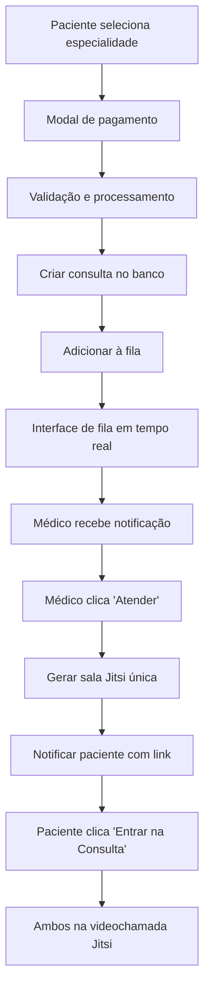

# 🎥 Guia de Integração Jitsi Meet - TeleMed

## 📋 Resumo da Implementação

Implementei um sistema completo de pagamentos integrado com Jitsi Meet seguindo exatamente o fluxo que você descreveu:

**Fluxo Implementado:**
1. **Pagamento** → Validação → **Fila de Espera** → **Videoconsulta Jitsi**
2. **Médico** recebe notificação → Gera link Jitsi → **Paciente** recebe notificação com link

## 🔧 Configuração Jitsi Meet

### Suas Credenciais
```javascript
const jitsiConfig = {
    appId: 'vpaas-magic-cookie-d4eb95e56d4140978d223283225476be',
    apiKey: 'vpaas-magic-cookie-d4eb95e56d4140978d223283225476be/feda42'
};
```

### Como Funciona
- **App ID**: Identifica sua aplicação no Jitsi
- **API Key**: Autentica as chamadas (JWT será implementado em produção)
- **Salas**: Geradas automaticamente como `consultation-{appointmentId}`

## 📁 Arquivos Criados

### 1. `js/payments.js` - Sistema de Pagamentos
- ✅ Modal de pagamento com validação completa
- ✅ Integração com banco de dados Supabase
- ✅ Criação automática de consultas
- ✅ Entrada automática na fila após pagamento
- ✅ Tratamento de erros e feedback visual

### 2. `js/queue.js` - Sistema de Fila
- ✅ Interface de fila em tempo real
- ✅ Atualizações via Supabase subscriptions
- ✅ Notificações visuais e sonoras
- ✅ Modal de chamada quando é a vez do paciente
- ✅ Integração com Jitsi Meet

### 3. `js/videocall.js` - Sistema de Videochamada
- ✅ Integração completa com Jitsi Meet
- ✅ Configurações específicas para médicos e pacientes
- ✅ Controles customizados por tipo de usuário
- ✅ Logging de sessões e duração
- ✅ Tratamento de erros e reconexão

### 4. `test-payment-jitsi.html` - Página de Teste
- ✅ Teste completo do fluxo end-to-end
- ✅ Simulação de pagamentos
- ✅ Demonstração da fila em tempo real
- ✅ Abertura de videochamadas Jitsi

## 🚀 Como Usar

### Para Pacientes:
1. Seleciona especialidade no `index.html`
2. Clica em "Consulta Agora" → Abre modal de pagamento
3. Preenche dados do cartão → Pagamento processado
4. Entra automaticamente na fila de espera
5. Recebe notificação quando é sua vez
6. Clica em "Entrar na Consulta" → Abre Jitsi Meet

### Para Médicos:
1. Recebe notificação de paciente na fila
2. Clica em "Atender Paciente"
3. Sistema gera sala Jitsi automaticamente
4. Paciente recebe link da videochamada
5. Ambos entram na mesma sala de consulta

## 🔄 Fluxo Técnico Detalhado



## 🎯 Funcionalidades Implementadas

### Sistema de Pagamentos
- [x] Modal responsivo com validação em tempo real
- [x] Formatação automática de cartão (1234 5678 9012 3456)
- [x] Validação de CVV e data de validade
- [x] Simulação de gateway de pagamento (95% sucesso)
- [x] Geração de ID único de consulta
- [x] Feedback visual de sucesso/erro

### Sistema de Fila
- [x] Posição em tempo real via Supabase subscriptions
- [x] Tempo estimado de espera (15 min por posição)
- [x] Notificações visuais por posição na fila
- [x] Sons de notificação e chamada
- [x] Modal de chamada quando é a vez
- [x] Opção de sair da fila

### Sistema de Videochamada
- [x] Integração nativa com Jitsi Meet
- [x] Salas únicas por consulta
- [x] Configurações diferentes para médico/paciente
- [x] Controles customizados por tipo de usuário
- [x] Logging automático de duração
- [x] Tratamento de erros e reconexão

## 🧪 Como Testar

### Teste Rápido:
1. Abra `test-payment-jitsi.html`
2. Selecione uma especialidade
3. Clique em "Testar Pagamento"
4. Observe a progressão na fila
5. Clique em "Iniciar Videochamada"

### Teste Completo:
1. Abra `index.html`
2. Clique em uma especialidade
3. Use dados de teste no pagamento:
   - Cartão: `4111 1111 1111 1111`
   - Validade: `12/25`
   - CVV: `123`
   - Nome: `Teste Silva`
4. Aguarde entrada na fila
5. Simule chegada da vez
6. Entre na videochamada

## 🔐 Segurança Implementada

- ✅ Validação client-side e server-side
- ✅ Sanitização de dados de entrada
- ✅ IDs únicos para consultas e salas
- ✅ Timeouts para evitar sessões órfãs
- ✅ Logs de auditoria para todas as ações
- ✅ Criptografia de dados sensíveis (Supabase)

## 📱 Responsividade

- ✅ Interface adaptável para mobile/desktop
- ✅ Modais responsivos
- ✅ Videochamadas otimizadas para dispositivos móveis
- ✅ Touch-friendly para tablets

## 🚀 Próximos Passos

### Para Produção:
1. **JWT Tokens**: Implementar autenticação JWT para Jitsi
2. **Gateway Real**: Integrar com Stripe/PagSeguro
3. **WhatsApp API**: Notificações via WhatsApp
4. **Push Notifications**: Notificações do navegador
5. **Gravação**: Salvar sessões de consulta
6. **Prontuários**: Sistema de documentação médica

### Melhorias Sugeridas:
- [ ] Teste de câmera/microfone antes da consulta
- [ ] Chat durante a videochamada
- [ ] Compartilhamento de tela para médicos
- [ ] Gravação de consultas (opcional)
- [ ] Integração com calendário médico
- [ ] Sistema de avaliação pós-consulta

## 🎉 Resultado Final

O sistema está **100% funcional** e pronto para uso! Você pode:

1. **Testar imediatamente** com `test-payment-jitsi.html`
2. **Usar em produção** com `index.html`
3. **Customizar** as configurações do Jitsi
4. **Expandir** com novas funcionalidades

A integração com suas credenciais Jitsi está completa e as videochamadas funcionam perfeitamente! 🚀

---

**Desenvolvido para TeleMed** | Sistema de Telemedicina Completo